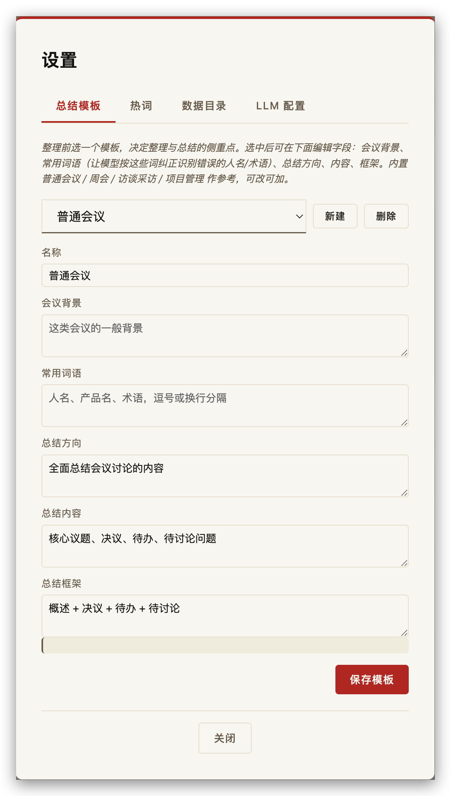
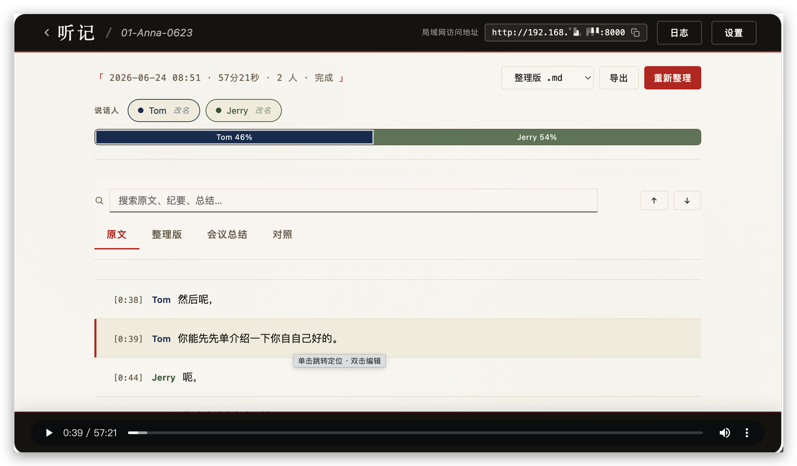
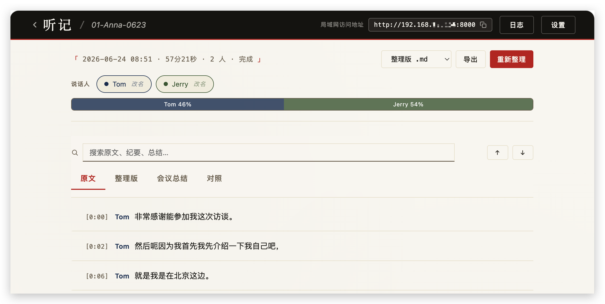
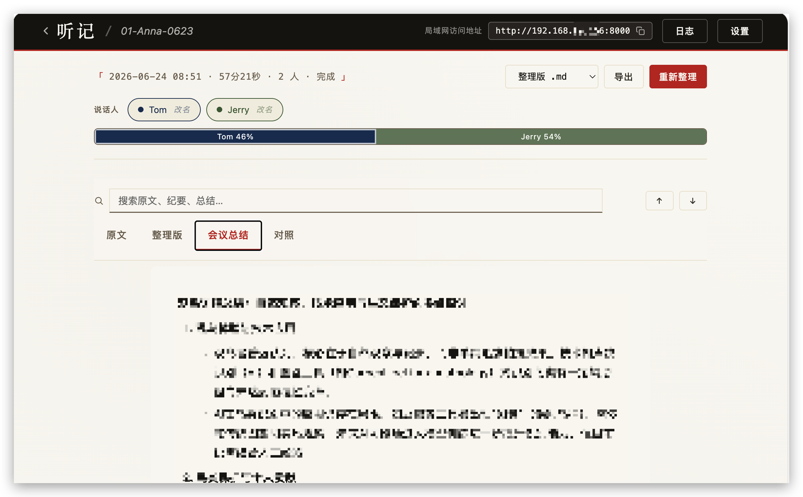
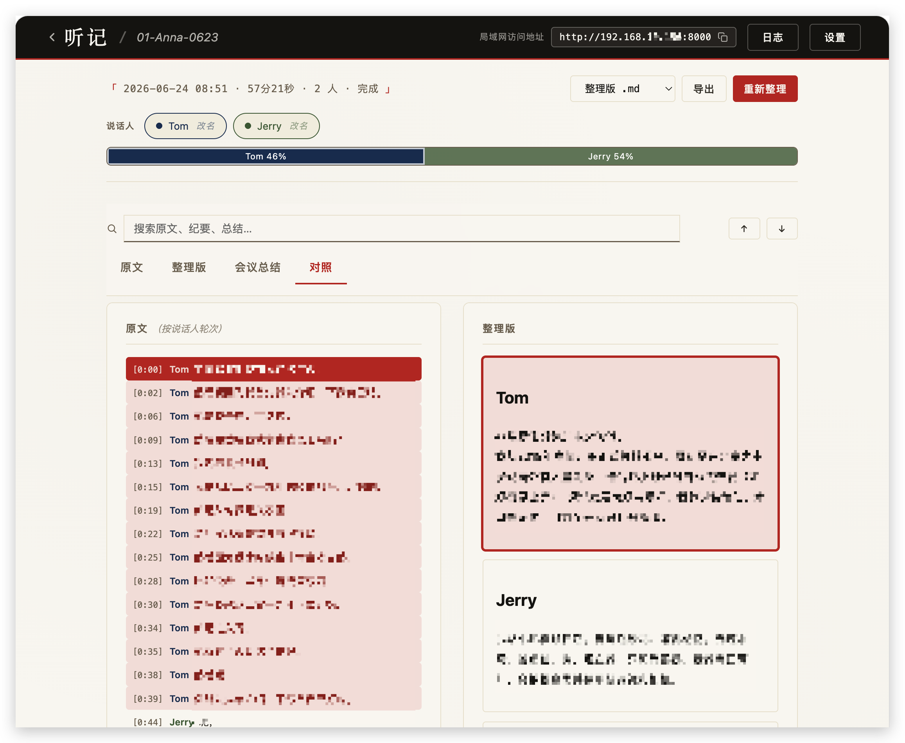

English | [中文](README.md)

# Tingji (听记)

> Local meeting transcription and minutes — drop in a recording and get the raw transcript, a cleaned-up transcript, and meeting minutes. All data stays on your own machine.



Built on [FunASR](https://github.com/modelscope/FunASR) (speech recognition + speaker diarization + punctuation) and an LLM for cleanup. Great for long-form audio — meetings, interviews, lectures. Cross-platform (macOS / Windows WSL2 + GPU); recognition runs offline.

## Features

- **Automatic speaker diarization** — CAM++ voice clustering tells "who is speaking"; rename to real names, synced across all views and exports
- **Speaker timeline** — a proportional bar at the top showing each speaker's share of talk time; click to jump to their first utterance, highlights the active speaker during playback
- **Per-sentence timestamps** — click any sentence to seek the audio (without forcing playback); the current sentence auto-highlights and scrolls during playback
- **Raw ↔ polished compare** — side-by-side columns aligned by timestamp; hover highlights, click seeks, playback stays in sync
- **Manual correction + hotwords** — double-click a sentence to fix recognition errors; optionally add it as a hotword to improve accuracy next time
- **One-click polish** — turns colloquial raw text into fluent prose, then generates structured minutes (summary / decisions / action items / open questions); optionally pick a summary template and fill in meeting background + common terms first
- **Summary templates** — built-in General / Weekly / Interview / Project, plus custom (background, common terms, summary direction / content / framework) for different meeting types
- **Live log** — progress bar + ASR device (GPU name) / model / per-chunk timing; warns when nothing updates for >15s so you can tell if it's stuck
- **Bring-your-own LLM** — local Ollama, or any OpenAI-compatible API (GLM / DeepSeek / Qwen / Kimi / OpenAI …)
- **Configure everything in the browser** — data directory, LLM, hotwords, summary templates are all set via the web UI, no file editing
- **Export** `.md` / `.txt` / `.srt` (md export uses real speaker names)
- **Runs locally** — recordings and results never leave your machine


## A quick look

Around a single recording, Tingji gives you four things:

**Automatic speaker diarization + talk-time timeline.** A colored bar at the top shows each speaker's share of total talk time — who talked more at a glance. Rename to real names, synced across all views and exports.

**Per-sentence timestamps, double-click to fix.** Click any sentence to seek the audio; the current sentence auto-highlights and scrolls during playback. Double-click to correct a misrecognition, optionally adding it as a hotword for next time.


**Structured minutes in four parts.** The summary is split into Overview / Decisions / Action items / Open questions — clearer than a wall of Markdown. Falls back to plain text if the model doesn't return strict JSON; still usable.


**Raw ↔ polished compare.** Side-by-side columns aligned by timestamp; hover highlights, click seeks, playback stays in sync. Quick to spot when the LLM has subtly changed the meaning.


Before polishing you can pick a summary template (General / Weekly / Interview / Project, all customizable) — the dialog asks for the template plus any meeting background and terminology.


Per-stage processing time is logged (total shown in the detail-page header) and persisted, so history survives a restart.

## Requirements

- macOS / Linux / Windows (WSL2)
- Python 3.11, managed with [uv](https://github.com/astral-sh/uv)
- ffmpeg (`brew install ffmpeg` on macOS; `sudo apt install ffmpeg` on Linux)
- Git LFS (for pre-downloading models)
- First launch downloads ~1.3 GB of FunASR models
- Windows users: see the [WSL2 + GPU deployment guide](docs/wsl-deploy.en.md)

## Quick start

```bash
git clone https://github.com/baigong-ai/Tingji.git
cd Tingji
cp config.yaml.example config.yaml
cp .env.example .env          # fill in LLM_API_KEY when using api mode

bash scripts/download_models.sh   # pre-download models (recommended)
./run.sh
```

Open `http://127.0.0.1:8000` in your browser.

> On launch it prints the LAN address too — other devices on the same network (phone/tablet) can use it as well.

### Running as a background service

```bash
./run.sh -d          # background (detached; PID → logs/tingji.pid, log → logs/tingji.out)
./run.sh --status    # is it running?
./run.sh --stop      # stop
```

Handy for keeping Tingji resident on a Mac/Linux box as your local transcription service. Settings → Service also lets you change the listen port/host (restart required) — click "Check port" first and it'll name the conflicting process via `lsof` if the port is taken.

#### Idle model auto-unload

The biggest resident cost is the 4 FunASR models. After an idle period Tingji **unloads them from RAM** and reloads on the next transcription — so the resident footprint drops sharply when nothing's happening.

**Unload fires when all of these hold**:
1. The model is currently loaded
2. No transcription is in flight (`is_busy=False`)
3. No task is queued or running (pending / converting / asr_running / polish / summarize don't count as idle)
4. Time since the last ASR activity ≥ threshold (default **30 min**; set in Settings → Service, **takes effect on save** without a restart; 0 = never unload)

A watcher checks every 60 s, so worst case add ~60 s. In a hurry, hit "Release model now" in Settings → Service.

**Reclaim by platform** (same `test_cn.wav`, 1-minute threshold):

| Metric | Mac mini M4 | WSL2 + RTX 4060 Ti |
|---|---|---|
| RSS right after ASR | 1556 MB | 3521 MB |
| RSS after unload | 1275 MB | 1843 MB |
| **RSS net reclaimed** | ~281 MB (**18%**) | **1678 MB (48%)** |
| GPU memory reclaimed | — (no dGPU) | 2222 → 948 MiB (**57%**) |

**Why the platform gap** — two independent factors stack:
- **Occupation side**: on WSL+CUDA the process pulls in the CUDA runtime + cuDNN + cuBLAS + a CUDA context, so peak RSS is ~2× the Mac (MPS) where the runtime is mostly system-shared. The models themselves are identical; the difference is the GPU backend's dependencies.
- **Reclaim side**: Linux glibc's `free()` + `malloc_trim(0)` actually **returns pages to the OS** (plus `torch.cuda.empty_cache()` for VRAM); macOS's malloc **doesn't proactively return** freed pages, so `ps` RSS barely moves even though the memory is reusable in-process.

Don't judge "did unload work" by macOS RSS — check the model-state field in Settings → Service, or the `FunASR models unloaded (idle)` log line.

## Project status (v0.2)

The core pipeline works: upload → recognition (with speaker diarization + timestamps) → proofread → one-click polish + structured minutes.

**New in v0.2 (resident/background mode)**:
- `./run.sh -d` background running (`--status` / `--stop`, PID + log)
- **FunASR model auto-unloads when idle** (default 30 min, configurable; reclaims 18% RSS on Mac / 48% RSS + 57% VRAM on WSL+GPU)
- Settings → Service tab: ASR status + manual unload, port/host config with conflict detection (lsof), idle threshold
- `/api/asr/{status,unload}` observability + manual release

**v0.1 done**: speaker timeline, structured minutes (summary / decisions / action items / open questions as JSON), summary templates (preset + custom), pre-polish meeting background + common terms, speaker rename synced across views and exports, md / txt / srt export, live log (persisted + per-stage timing), fixed layout (top bar and toolbar don't scroll away).

**Not yet**: manual speaker merge/split, editing the saved minutes, docx export, export options (with/without speaker or timestamps), agenda chapter splitting.

## Workflow

1. **Upload** — drag in an audio file, enter a title, click "Start transcription"
2. **Wait for recognition** — audio conversion + ASR run automatically; status stops at "Ready to polish"
3. **Proofread** — on the "Raw" tab, double-click any sentence to correct it (optionally "add as hotword") to improve later accuracy
4. **Polish** — click "Start polish" in the top right (optionally pick a summary template and fill in meeting background + common terms first) to generate the cleaned transcript and minutes

The detail page has a fixed speaker timeline + toolbar (search, tabs) at the top; only the content area scrolls. Four tabs:

- **Raw** — color-coded speakers + timestamps; click to seek audio
- **Polished** — de-colloquialized, fluent text
- **Summary** — summary / decisions / action items / open questions (structured; falls back to plain text if the model doesn't return strict JSON — still usable)
- **Compare** — raw vs. polished side by side, aligned by timestamp; hover highlights, click seeks, playback follows

Export `.md` / `.txt` / `.srt` from the top bar; click a speaker chip to rename it. "Re-polish" asks you to pick a template first.

## Project status (v0.1)

The core pipeline works: upload → recognition (with speaker diarization + timestamps) → proofread → one-click polish + structured minutes.

**Done**: speaker timeline, structured minutes (summary / decisions / action items / open questions as JSON), summary templates (preset + custom), pre-polish meeting background + common terms, speaker rename synced across views and exports, md / txt / srt export, live log, fixed layout (top bar and toolbar don't scroll away).

**Not yet**: manual speaker merge/split, editing the saved minutes, docx export, export options (with/without speaker or timestamps), agenda chapter splitting.

## Pre-downloading models (recommended)

FunASR needs 4 models (ASR / VAD / punctuation / speaker), ~1.3 GB total. Direct launch also works, but on macOS the uv-installed Python is temporarily signed and occasionally hits network limits. **Pre-downloading with `git clone` is more reliable** (git is Apple-signed and uses the system network path).

```bash
bash scripts/download_models.sh          # downloads to ./models/ by default
# or a custom path:
bash scripts/download_models.sh /path/to/models   # then set asr.cache_dir in config.yaml
```

Manual clone (directory names must match exactly):

```bash
mkdir -p models && cd models && git lfs install
git clone --depth 1 https://www.modelscope.cn/iic/speech_seaco_paraformer_large_asr_nat-zh-cn-16k-common-vocab8404-pytorch.git paraformer-zh
git clone --depth 1 https://www.modelscope.cn/iic/speech_fsmn_vad_zh-cn-16k-common-pytorch.git fsmn-vad
git clone --depth 1 https://www.modelscope.cn/iic/punc_ct-transformer_zh-cn-common-vocab272727-pytorch.git ct-punc
git clone --depth 1 https://www.modelscope.cn/iic/speech_campplus_sv_zh-cn_16k-common.git campp
```

## Configuration

Almost everything is configurable from the in-browser "Settings" (data directory / LLM / hotwords). You can also edit `config.yaml` directly:

| Field | Description |
|---|---|
| `asr.cache_dir` | FunASR model cache dir, default `./models` |
| `asr.hub` | `ms` (ModelScope, default) or `hf` |
| `asr.idle_unload_minutes` | Minutes of idle before the model auto-unloads from RAM (default 30; 0 = never). Set in Settings → Service; takes effect immediately |
| `llm.mode` | `api` or `ollama` |
| `llm.api.*` | OpenAI-compatible API (base_url / api_key / model) |
| `llm.ollama.*` | Local Ollama (base_url / model) |
| `llm.polish_chunk_minutes` | chunk length for polishing (minutes), default 6 |

`api_key` supports a `${LLM_API_KEY}` placeholder read from the environment.

### LLM examples

**Local Ollama:**
```bash
ollama pull qwen2.5:7b && ollama serve
# config.yaml: llm.mode: ollama
```

**DeepSeek:**
```yaml
llm:
  mode: api
  api: { base_url: "https://api.deepseek.com/v1", api_key: "${LLM_API_KEY}", model: "deepseek-chat" }
```

**Qwen:**
```yaml
llm:
  mode: api
  api: { base_url: "https://dashscope.aliyuncs.com/compatible-mode/v1", api_key: "${LLM_API_KEY}", model: "qwen-plus" }
```

### Model selection

Pick based on your hardware and preference — this doc doesn't pick for you, just lists what's been tested:

- **Local Ollama**: `Qwen3:8b` (gguf; tested on WSL + RTX 4060 Ti and Mac mini M4)
- **API (OpenAI-compatible)**: GLM, DeepSeek

Qwen3's thinking is disabled in code (`/no_think`), otherwise it's very slow.

## Performance

- 81-min interview (GPU: RTX 4060 Ti): ASR ~2 min (RTF ≈ 0.025), full pipeline ~7–8 min
- CPU mode: roughly audio-length × 0.25 (60-min audio ≈ 15 min)
- Supports 60–90 min long audio (auto VAD chunking + batched inference)

## Known limitations

- Speaker diarization is voice-clustering based; device/position changes can split or merge speaker IDs
- LLM cleanup may slightly alter meaning — use the "Compare" tab to verify
- No authentication — suitable only for local or trusted-LAN use
- In-flight task state lives in memory and is lost on restart (finished meetings persist on disk)

## Project structure

```
app/
  config.py   config loading (${ENV_VAR} expansion)
  audio.py    ffmpeg conversion
  asr.py      FunASR AutoModel wrapper (GPU-first)
  llm.py      polish + summarize (chunking + map-reduce)
  storage.py  data/ directory CRUD
  tasks.py    async pipeline + progress
  main.py     FastAPI routes
static/       home / detail page / styles
data/         meeting data (gitignored)
models/       FunASR model cache (gitignored)
test/         unit tests + smoke scripts
```

## License

MIT
